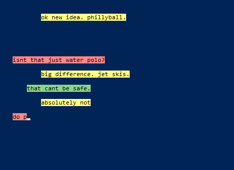

# slowtype.py

This python module makes it possible to generate
output from programs that mimics human typing style.

This program is used to emulate the styles of
Jon Bois's hit webcomics, 17776 and 20020. 
This massively decreases video production time,
especially for content that is already written. Jon records himself manually typing the words he wants to appear on screen, which is why he needed the preceeding periods - these held the style for the line he was probably copying by eye from a written script in a different window.


Color utilities can also be used for displaying 
homestuck pesterlog content in a terminal.



## Usage

The `chars.txt` file is basically a csv that defines the color for the characters. Here are some examples for our protagonists:

| Identifier | Text Color | Highlight Color | Indentation |
| --- | --- | --- | --- |
| j | #000000 | #fef29a | 3 | 
| 9 | #000000 | #ff8080 | 1 |
| 10 | #000000 | #89dc89 | 2 |


There are two primary ways to use this software

### Reading a Script

This is the easiest way, just put your text in the
templates for `script.txt` and `chars.txt` and the
program, when run in the same directory, will read
the script with the apropriate formatting.

To create your video, you can screenrecord the text scrolling on the terminal, and this can then be chroma-keyed in your video editing software of choice and overlaid on the google earth screenrecord. There are a lot of ways to integrate this into your workflow, see my video at https://www.youtube.com/watch?v=AtiP78hkZ2s for an example.

### Incorperating into other programs

import the module with

```Python
from slowtype.py import Slowtype
```

and then create a new object

```Python
S = Slowtype('chars.txt')
```

and then you can have it read any line in the script with

```Python
S.slow_print(line)
```